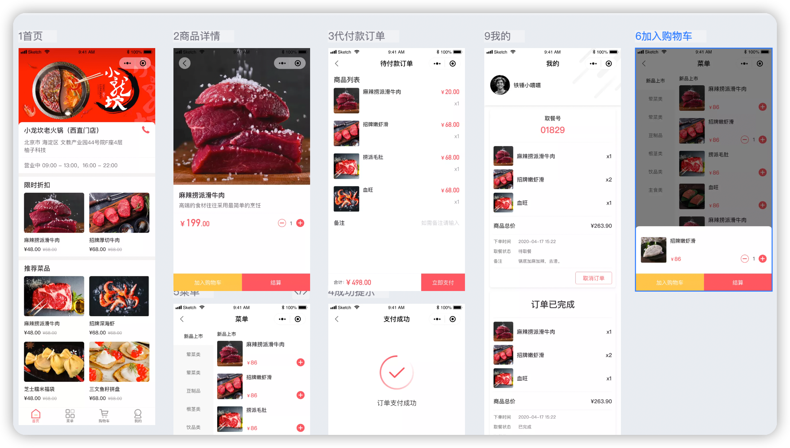
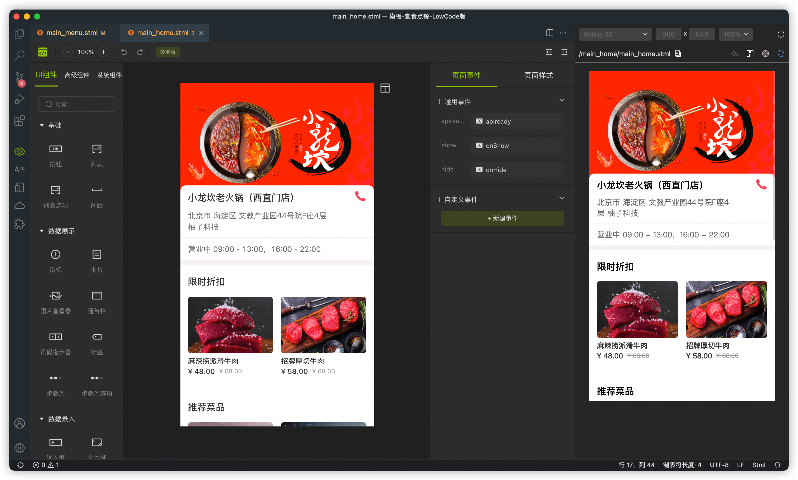
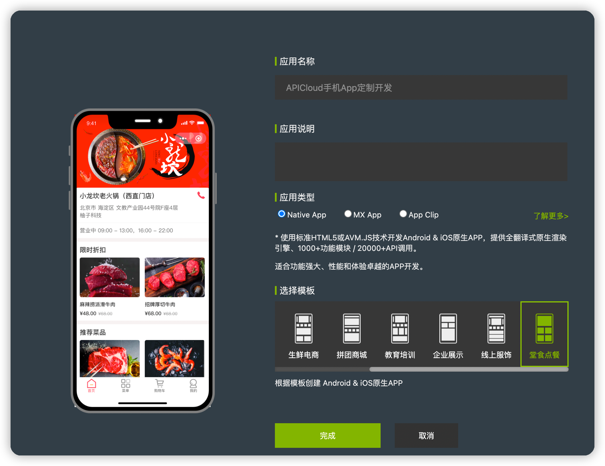
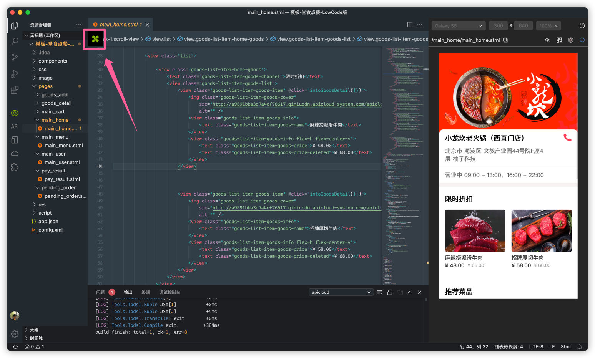

## 项目介绍
### 功能描述

该模板为生鲜电商App应用模板，主要功能包括商品列表展示、商品详情查看、购物车、个人中心、基础设置等。通过此模板的使用能快速上手AVM多端开发技术，并能在此模板基础上使用可视化工具快速开发出一套完整的生鲜电商类应用。里面涉及到的所有页面用到的数据都是静态数据。目的是为了实现在APICloud Studio3可视化工具设计界面中能够正常显示页面中的内容。

#### 整体设计稿预览

#### 可视化界面显示效果截图

#### 源码文件目录结构说明

项目源码在widget目录下，该目录下的文件说明如下：

~~~text
┌─component/                项目公共组件目录
│  ├─empty-block.shtml      空数据占位图组件
│  ├─goods-action.shtml     商品下单动作组件
│  ├─goods-counter.shtml    商品加购计数器组件
│  ├─goods-list-item.shtml  主页商品列表单品组件
│  ├─order-item.shtml       订单列表单品组件
│  ├─radio-box.shtml        自定义选择器组件
├─css/                      css样式目录
├─image/                    图片素材图标资源目录
├─pages/                    新版的AVM页面目录
│  ├─goods_add
│  │  └─goods_add.stml      加购浮层
│  ├─goods_detail
│  │  └─goods_detail.stml   商品详情页
│  ├─main_cart
│  │  └─main_cart.stml      主tab-2 购物车页面
│  ├─main_home
│  │  └─main_home.stml      主tab-0 商家主页
│  ├─main_menu
│  │  └─main_menu.stml      主tab-1 点餐菜单页面
│  ├─main_user
│  │  └─main_user.stml      主tab-3 用户主页
│  ├─pay_result
│  │  └─pay_result.stml     支付结果页
│  ├─pending_order
│  │  └─pending_order.stml  待付款结算页
├─script/                   JavaScript脚本目录
└─config.xml                应用配置文件
~~~

### 怎么使用可视化工具进行开发
1. 下载最新版的APICloud Studio 3
2. 下载成功后，安装后打开，顶部菜单选择【项目】-【新建项目】，填写应用名称，选择相应模板，点【完成】按钮进行创建。

3. 创建完项目后打开某一个页面，点击左上角图标可切换为可视化界面，可进行页面的设计，左侧栏可根据项目需求拖拽任意组件到画布中，右侧属性设置栏可对拖拽的组件进行设置。具体操作可查看 可视化工具的使用视频。

### 技术支持
使用中若有任何疑问可到APICloud论坛 AVM多端 专区发帖提问。官方技术支持和众多活跃开发者会第一时间为您提供技术支持。
